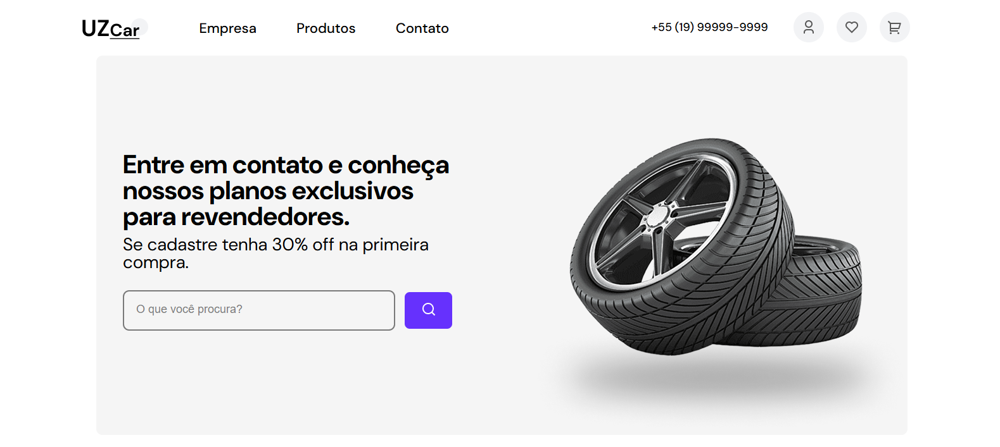

# Loja de Pneus 🚗

Este projeto é um site simples de uma loja de pneus, desenvolvido para estudo e prática de HTML e CSS.

---

[LINK PARA O FIGMA](https://www.figma.com/proto/r9xfJCQeqXjMwNyQpJ8LD5/HTML-E-Commerce-Pneus?node-id=503-784&t=yuhtjm5qGTLdFGjc-1&scaling=min-zoom&content-scaling=fixed&page-id=0%3A1)

[LINK PARA O SITE FUNCIONAL](https://enzgl.github.io/loja-pneu/)

## 📷 Imagem do projeto

## 📌 Tecnologias Utilizadas
- **HTML5** para estruturação do site.
- **CSS3** para estilização e design.

## 📜 Funcionalidades
- Página inicial com informações sobre a loja.
- Catálogo de pneus com imagens e descrições.
- Contato com formulário simples.

## 📌 Objetivo
Este projeto foi criado exclusivamente para fins educacionais, visando aprimorar o conhecimento em desenvolvimento web com HTML e CSS.

---

💡 **Sugestões e melhorias são sempre bem-vindas!**

